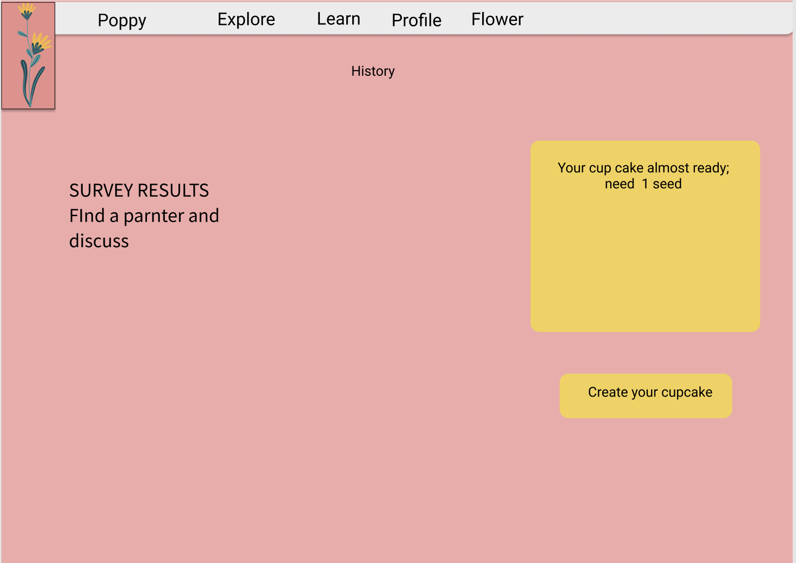
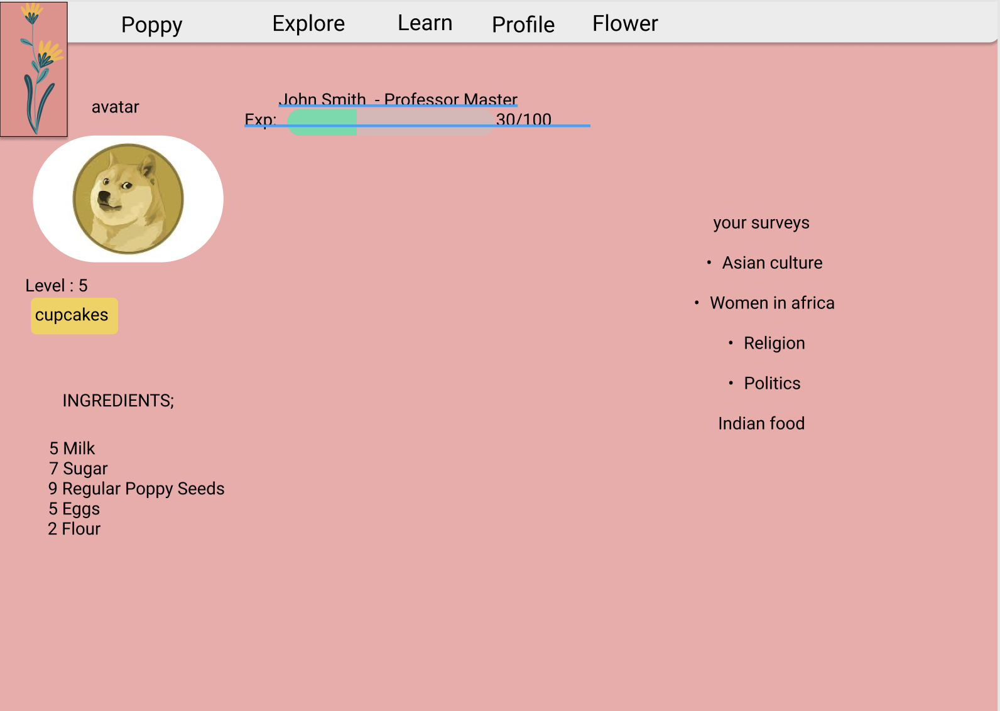
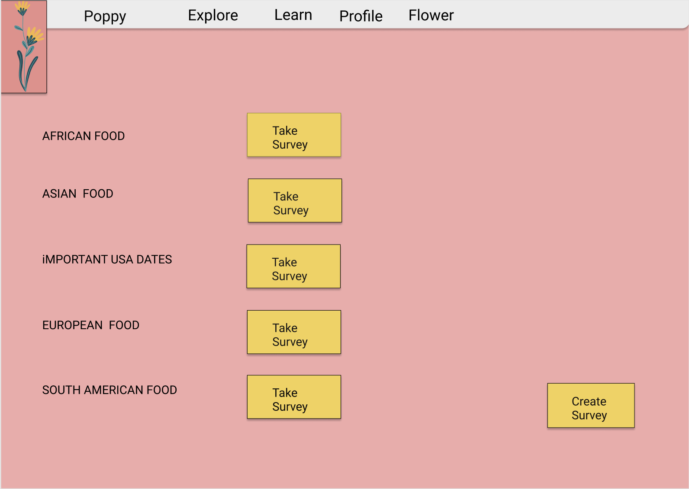
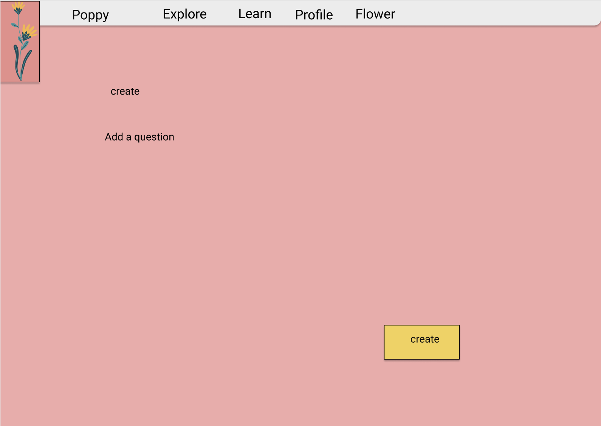
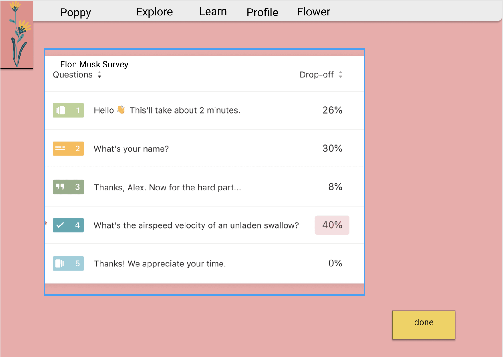
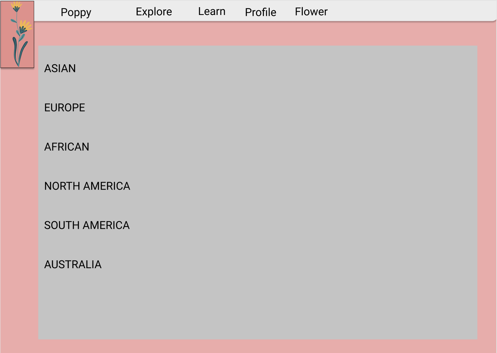
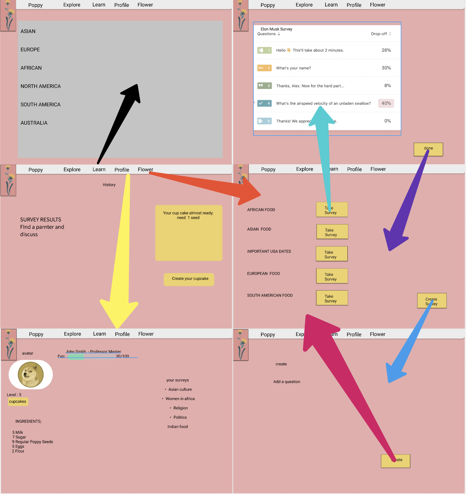

# Spec

# Poppy 
s
  

## Problem statement 

  

Adolescents to young adults crave exploration- of different opinions and experiences to form connections that are deeper than surface level. They also value a chance to escape from their reality. Given this, how might we allow them to interact with those from different backgrounds and cultures in order to broaden their worldview? 

 

  

## Summary 

  

Ever get tired of scrolling through social media or see the same people posting about their glamorous vacations, and think, do I really know the 500+ people I follow? What if you could form connections that are deeper than surface level while learning about new cultures and exchanging ideas?... Do you want to break out of your bubble? Then you can use Poppy©. Poppy© is a web app that allows you to connect AND communicate with those from different backgrounds and cultures. This app will guide you to learn more and see the world in different perspectives. It is different from other social media apps because it is designed to help foster genuine connections that are tailored to help you see your world from a different lens. So, are you ready to break your bubbles? 

  

## Customer profile 

  

Poppy's initial target market is Adolescents to young adults. 

  

* Who – Adolescents to young adults who wants to learn and explore. 

* What – Web App that brings people together to learn about different perspectives. 

* Where - Website 

* Why –People want to learn and embrace different cultures, but they don’t know where to start from. Also, it is hard to connect with people from different backgrounds in a safe way. 

* When – you want to learn more about different cultures. Also, when you want to travel different countries. 

* How – come and get your survey. Join and connect with people. 

  

Kat is a young teenager who wants to learn more about African culture. But she cannot find any app that allows her to find someone and talk about African culture. 

  

Marcos is a person who wants to travel whole Europe. He is excited about his trip. But he wants to learn more about culture and what European people likes and dislikes. 

  

John doesn’t feel connected to his friends on other social media platform, he’s looking for a medium where he can truly connect and get to know the people he’s connected to rather than scrolling through people’s feed.  

  

## Goals 

  

* Educate the users about different backgrounds and perspectives. 

* Learn more about the world. 

* Motivate people to learn about different points of view by making learning fun through gamification. 

* Allow people to make deeper connections with other people. 

 

 

## In scope 

  

* P0: A user can create survey- limited 

* P0: A user can pick what survey they want to answer from a list 

* P0: A user can get questions from the survey they picked 

* P0: A user can see their xp/ level /ingredients and profile. (profile) 

* P0: A user can see the explore page. 

* P0: A user can educate themselves ( Educate page)

* P0: A user can create cupcakes in the (explore page) 

* P0: A user can navigate to different pages through  

* P1: A user can have friends and send them cupcakes 

* P1: A user can see their history 

* P1: A user can message friends 

* P2: A user can Register and login (INTRODUCTION PAGE) 

 

 

## Out of scope 

  

* 3D animations 

* A user can send stories 

* A user can see world map and see news and stories. 

* A user can see leaderboard 

* Algorithm to match the most likely responses 

* Online rooms where user can get survey with other users.
 

  

## UX 

  

*This spec just includes UX for the P0 items as part of the team practice project. Final specs should include UX for all listed user stories* 

  

  

The image assets are in the [Pictures](Pictures) folder - icon, upload, blender. 

  

User lands this explore page. User can see survey results and User can see what other users answered for that survey. User have a history board. User can create cupcakes and see which ingredients left for a cupcake.

 

  

Profile page has user's avatar, level, xp and amount of cupcakes they receives. User also see their ingredients for cupcake. User can see their surveys.

 

  
This is the Flower page. User can see survey's and pick one of them.

 

  

This is the Plant seeds page. User can create surveys. User need to pick what type of survey User is creating. 

 

This is the Get seeds page. User gets their survey ( the one user picked from flower page).

 

User can learn about new cultures. 

 

  

This screen describes the app navigation, how the screens of the app are connected. 

 

  

## Breakdown of work 

  

|  User Story  | Assigned to  | 
|---|---| 
| A user can pick what survey they want to answer from a list  | | 
| A user can get questions from the survey they picked   | | 
| A user can see their xp/ level /ingredients and profile. (profile)  | | 
| A user can see the explore page.   | | 
| A user can educate themselves ( Educate page )   | | 
| A user can create cupcakes in the (explore page)   | | 
| A user can navigate to different pages through   | | 
| ... | ... | 

  

*How is the app being built?, Who's doing the work?* 

  

## Compete analysis 

  

Competitors of Poppy today include: 

  

* Omegle
* Instagram
* social media apps 
* Most social media apps allow you to connect more people and allows you to spend time on it.
  

Poppy is different because of the way it is designed for users to spread ideas and share opinions that brings them together instead of further alienating us. Most social media is not made to foster connections that are more than surface level with complete strangers, Poppy looks to change that. From the summary of the competitive analysis, the primary strength, weaknesses, opportunities, and threats of Poppy are: 

  

Strengths: 

  

* Can work anywhere.

*  Learn about how people different than yoursellf live on a day to day basis

* Helps feel a better part of your own community and promote pride for the different communities you are a part of by sharing about thme

* It is designed to help foster genuine connections that are tailored to help you see your world from a different lens. 

 

Weaknesses: 

  

* User must create surveys in order to be effective. 

* Won’t have many features. 

  

Opportunities: 

  

* Adolescents to young adults are ready to learn and explore more about world 

* Travelers will have a better idea of different communities and places to visit. 

* College students will have a better chance of learning about other cultures.  

  

Threats: 

  

* Other applications may be more attractive than ours. 

* Bad surveys may cause problems (need an approval for surveys) 

 

  

## Future opportunities 

  

Expand target communities. 

  

* Poppy can have more exciting features. 

* User can see what the people are celebrating among the world. 

  

Revenue model 

  

* Poppy will not chase a revenue model of ads or selling user data. 
